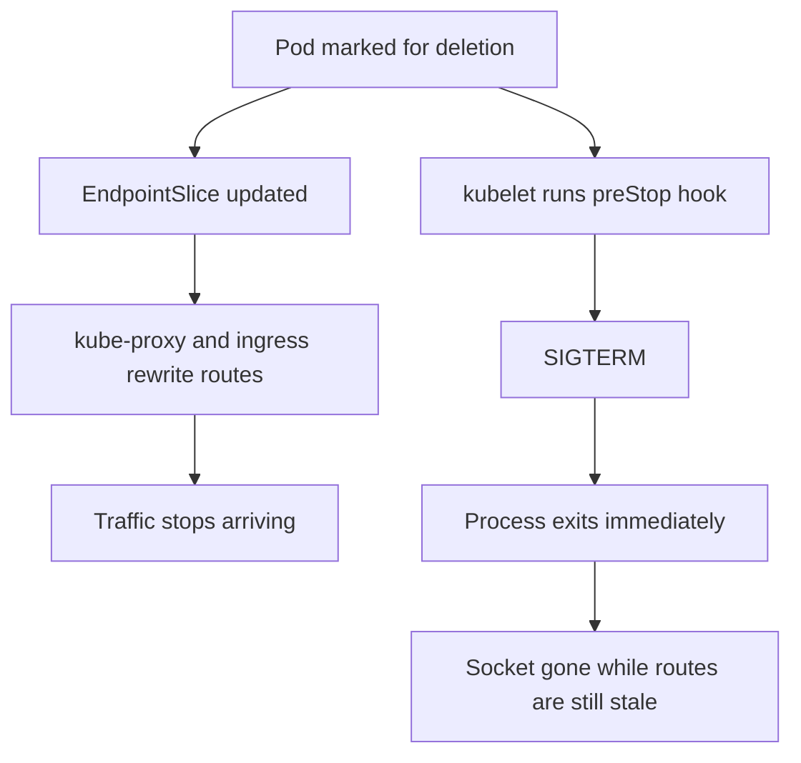

# Deployment Design: Zero-Downtime Rollouts

| | |
|---|---|
| **Status** | Verified on Kind (Kubernetes v1.36.1, single node, arm64) |
| **Component** | `k8s/deployment.yaml`, `k8s/pdb.yaml` |
| **Verification** | `scripts/verify-zdd.sh` |
| **Requires** | Kubernetes >= 1.30 for `lifecycle.preStop.sleep`, enforced as a preflight in `scripts/verify-zdd.sh` |

## Decision

Probes decide which pods receive traffic. They say nothing about a pod being
taken away. Startup and shutdown are therefore solved separately here, because
in this application they fail for different reasons.

Two properties of `main.go`, both read rather than assumed, drive the rest.

## Startup: the app refuses connections for ten seconds

Two things to keep in mind when touching the probes:

- The delay at `main.go:216` runs before `ListenAndServe` at line 220, so probes
  get connection-refused during that window, not a 503.
- `/health` is a static 200 with no dependency checks.

Settings: startup 2s x 15 (30s budget, gates the other two), readiness 5s x 2
(~10s to eject), liveness 10s x 3 (~30s to restart).

## Shutdown: the app dies instantly

`log.Fatal(http.ListenAndServe(...))` never calls `signal.Notify` or
`srv.Shutdown()`, so SIGTERM kills the process and every in-flight request with
it. That alone is survivable. The outage comes from pod deletion starting two
unsynchronised processes at once:



Route removal is eventually consistent and has to reach kube-proxy on every node
and the ingress controller. Shutdown does not wait for it. If the right branch
finishes first, clients get connection-refused. The `preStop` hook is a delay
inserted into the right branch so the left branch wins.

## Why the sleep action rather than exec

- `exec` runs inside the container, and distroless has no shell and no `sleep`.
  Adding one would undo the "no shell, no coreutils" control claimed in
  `docs/security-risk-acceptance.md`.
- **A failed preStop hook does not block termination.** The kubelet logs a
  `FailedPreStopHook` event and carries on, so a broken hook is indistinguishable
  from a working one. Hence `scripts/verify-zdd.sh` times a real deletion.
- The native `sleep` runs in the kubelet, outside the container. Below
  Kubernetes 1.30 the fallback is a static `sleep` binary copied into the image.

## Rollout and disruption

`maxUnavailable: 0` with `maxSurge: 1` forces create-then-delete ordering. Above
zero, the controller may delete first, which is how capacity disappears
mid-rollout. `minReadySeconds: 5` stops a pod that starts and immediately dies
from counting as a success. The cost: the rollout is serial, needs one pod of
spare capacity, and takes about 75 seconds for three replicas.

None of that applies outside a rollout. `maxUnavailable: 0` binds only the
Deployment controller; `kubectl drain` and the cluster autoscaler go through the
Eviction API. `k8s/pdb.yaml` closes that gap with `maxUnavailable: 1`, chosen
over `minAvailable: 2` because it stays correct at any replica count.

## What this does not cover

The hook does not make shutdown graceful. Requests in flight at SIGTERM are
still dropped; the hook only stops new ones arriving. The real fix is about
eight lines in `main.go`, deliberately not made because the application is
treated as given.

A PDB only constrains the Eviction API. `kubectl delete pod` bypasses it.

`http.ListenAndServe(":"+port, nil)` sets no `ReadTimeout`, `WriteTimeout` or
`IdleTimeout`, so slow clients can hold connections indefinitely. Mitigated at
the ingress, not in the app.

The secret is read once at startup, so rotation requires
`kubectl rollout restart deployment/ping-pong`.

## Verification

Four checks: the first three diagnose the hook, the fourth is the claim itself.
Check 4 needs the Service from #4, and all four need the Secret from #5. A
`kubectl port-forward` is not a substitute for the Service, since it connects
directly to one pod and never consults EndpointSlices.

```
$ ./scripts/verify-zdd.sh

1. Did the API server keep the preStop field?
  PASS  preStop retained: {"sleep":{"seconds":10}}
2. Does termination actually wait?
  PASS  deleting ping-pong-5f48d85546-dmlzw took 11s (hook ran)
3. Did the kubelet complain?
  PASS  no FailedPreStopHook events
4. Does traffic survive a rollout?
        271 requests during the rollout, 271 x 200
  PASS  zero non-200 responses across the rollout

passed 4, failed 0, skipped 0
```

### Negative control

A test that cannot fail proves nothing. With the hook patched out, the same
script reported:

```
1. FAIL  no preStop hook on the deployment
2. FAIL  deleting ping-pong-57bd7bd8d4-bbjqx took 1s, expected >= 8s
3. PASS  no FailedPreStopHook events
4. PASS  zero non-200 responses across the rollout
```

Checks 1 and 2 discriminate cleanly: 1s against 11s.

**Check 4 does not.** It passed identically with and without the hook, so on
this cluster it does not isolate the hook's contribution. On a single node,
endpoint removal is a local kube-proxy rewrite measured in milliseconds, and at
5 requests per second the window is never hit.

Raising the rate produced a misleading number worth recording so nobody repeats
it. Three concurrent tight loops during a hookless rollout showed 29,723
failures of 57,955 requests, which looks damning until the control: the same
load with *no rollout at all* still failed 16,174 of 44,406. Each replica
requests 25m CPU and logs synchronously per request, so a tight loop measures
the throughput ceiling, not the endpoint race. Measurement discarded.

So checks 1-3 prove the hook runs, and check 4 proves the rollout meets the
acceptance criterion. Neither proves the hook is *why*, and on one node it
probably is not. The race widens with node count and behind an ingress, which is
where the hook earns its place and which Kind cannot reproduce.

### The disruption budget

```
$ kubectl drain echo-pong-k8s-control-plane \
    --pod-selector app.kubernetes.io/name=ping-pong --ignore-daemonsets

evicting pod default/ping-pong-549b5bcdc7-hz6j8
evicting pod default/ping-pong-549b5bcdc7-7tff6
evicting pod default/ping-pong-549b5bcdc7-bb4s9
error when evicting pods/"...hz6j8" (will retry after 5s): Cannot evict pod as it would violate the pod's disruption budget.
error when evicting pods/"...7tff6" (will retry after 5s): Cannot evict pod as it would violate the pod's disruption budget.
pod/ping-pong-549b5bcdc7-bb4s9 evicted
```

The drain asked for all three and got exactly one. Without the PDB all three
would have gone together.

It also shows the deadlock a PDB can cause: the node is cordoned during a drain,
so the replacement cannot schedule, so availability never recovers and the
remaining evictions are refused indefinitely. Unavoidable on one node; on a real
cluster the replacement lands elsewhere and the drain proceeds one at a time.

## Reproducing this

```bash
# Needs a cluster >= 1.30, the Secret from #5, the Service from #4.
kubectl apply -f k8s/
kubectl rollout status deploy/ping-pong
./scripts/verify-zdd.sh

# By hand:
kubectl get deploy ping-pong \
  -o jsonpath='{.spec.template.spec.containers[0].lifecycle.preStop}'
time kubectl delete pod "$(kubectl get pod -l app.kubernetes.io/name=ping-pong \
  -o jsonpath='{.items[0].metadata.name}')"
kubectl get events --field-selector reason=FailedPreStopHook
kubectl drain <node> --pod-selector app.kubernetes.io/name=ping-pong \
  --ignore-daemonsets
```
