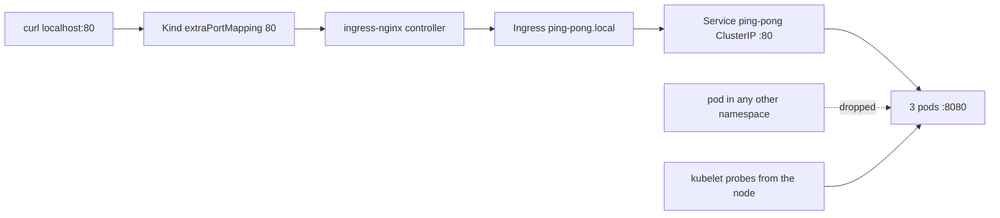

# Exposure Design: Getting Traffic In, and Keeping Everything Else Out

| | |
|---|---|
| **Status** | Verified on Kind (Kubernetes v1.35.5, single node, arm64, Calico v3.32.1) |
| **Component** | `k8s/service.yaml`, `k8s/ingress.yaml`, `k8s/networkpolicy.yaml` |
| **Verification** | `scripts/smoke-test.sh` checks 1, 2 and 6 |
| **Requires** | An ingress controller and a CNI that enforces NetworkPolicy, both installed by `scripts/cluster-up.sh` |

## Decision

Issue #4 asks for no direct internet access to the pods. That splits into two
questions that are usually conflated, and only the first is about the Ingress.

North-south is the way in from outside. A `ClusterIP` Service and an Ingress
answer it: there is no NodePort and no LoadBalancer in front of the application,
so nothing outside the cluster can address a pod except through the proxy.

East-west is everything already inside the cluster. Kubernetes' default here is
allow-all, and an Ingress does nothing about it. Pod IPs stay routable from every
namespace, so `k8s/networkpolicy.yaml` is what turns the ingress from a front
door into the only door.



The Service names its target port rather than repeating `8080`, so the Service
and the container cannot drift apart. Check 1 of the smoke test asserts the
negative directly, because "an Ingress exists" and "nothing else is a way in"
are different claims and a NodePort added later would satisfy only the first.

## The ingress controller is a dead project

`kubernetes/ingress-nginx` was archived in March 2026 at `controller-v1.15.1`.
Its designated successor, `kubernetes-sigs/ingate`, was archived and marked EOL
in June 2026. Neither will receive another patch.

It is used here anyway, deliberately and with a shelf life. It remains what most
organisations actually run, the manifests are the ones a reviewer will recognise,
and the alternatives, Traefik v3.7 and Envoy Gateway v1.8, would each trade that
familiarity for a migration this assignment does not need. What follows is the
cost of that choice, stated rather than hidden.

**It caps the Kubernetes version.** The support matrix for v1.15.1 stops at 1.35.
`kind/cluster.yaml` pins `kindest/node:v1.35.5` for that reason alone, even
though kind v0.32 defaults to 1.36.1 and the cluster this was first built on ran
1.36.1. A retired ingress controller now dictates the control plane version,
which is a better argument for migrating than any feature comparison.

**It will accumulate CVEs exactly like the Go toolchain.**
`docs/security-risk-acceptance.md` makes this argument for `stdlib 1.24.13`: an
unmaintained dependency accrues vulnerabilities while its source never changes.
The difference is that the Go finding is in the application image and this one is
in cluster infrastructure, so it is not something a rebuild of this repository
can ever fix.

Review by 2026-09-07, alongside the Go toolchain acceptance. The migration target
is Gateway API, and `k8s/ingress.yaml` is deliberately plain enough, with no
controller-specific annotations at all, that it maps onto an `HTTPRoute` almost
line for line.

## What protects the app from slow clients

`docs/deployment-design.md` notes that `http.ListenAndServe(":"+port, nil)` sets
no `ReadTimeout`, `WriteTimeout` or `IdleTimeout`, so a slow client can hold a
connection open indefinitely, and says the fix belongs at the ingress. It does,
but not through anything configured here, and the distinction is worth being
precise about because it is easy to get backwards.

The protection is structural. nginx terminates the client connection and opens
its own connection to the pod, so the application only ever talks to a
well-behaved local client. A Slowloris-style client is holding nginx open, not
the Go process, and nginx bounds that with `client_header_timeout` and
`client_body_timeout`, both 60 seconds by default:

```
$ kubectl -n ingress-nginx exec deploy/ingress-nginx-controller -- \
    cat /etc/nginx/nginx.conf | grep client_.*timeout
client_body_timeout             60s;
client_header_timeout           60s;
```

`k8s/ingress.yaml` therefore carries no annotations. The tempting ones,
`proxy-read-timeout` and `proxy-send-timeout`, would not have helped: they bound
nginx's wait on the *upstream*, not on the client, so they guard against a slow
pod rather than a slow caller. Tightening them from the default 60 seconds would
have changed nothing for an application that answers in microseconds, while
reading as though it solved the slow-client problem. The two knobs that do face
the client are controller-wide ConfigMap settings rather than per-Ingress
annotations, and their defaults are already sensible.

Authentication is not moved to the proxy. `/ping` and `/pong` check the bearer
token at `main.go:58` regardless of how the request arrived, which is what makes
the token still meaningful if the policy is ever misconfigured.

## The NetworkPolicy, and why a passing test nearly proved nothing

The policy selects the application pods, which makes them default-deny for
ingress, then allows only the `ingress-nginx` namespace on port 8080. Egress is
left alone on purpose: the application makes no outbound connections, and
restricting egress without allowing DNS is a standard way to break a cluster for
no benefit.

Two details are worth knowing before touching it.

- The port is the literal `8080`, not the name `http`. Named ports in a
  NetworkPolicy resolve against container port names and CNI support is uneven; a
  name that fails to resolve matches nothing and fails open.
- There is no exemption for test tooling. That is why `scripts/verify-zdd.sh`
  probes through the ingress controller instead of hitting the Service, and it is
  what lets `scripts/smoke-test.sh` use an ordinary pod in its own namespace as
  the blocked case.

The trap is the CNI. Kind's default, kindnet, ships no policy enforcer at all,
while the `NetworkPolicy` API is registered regardless because it is a core API.
Applied to a stock Kind cluster this manifest is accepted by the API server and
enforced by nobody: `kubectl get netpol` looks correct and the control does not
exist. It is the same shape of failure as the `FailedPreStopHook` problem that
`verify-zdd.sh` was written to catch. `kind/cluster.yaml` therefore sets
`disableDefaultCNI: true` and `scripts/cluster-up.sh` installs Calico.

So the check runs the request twice and needs the first one to succeed:

```
6. Is the NetworkPolicy actually enforced?
  PASS  control: with no policy, netpol-probe reached the pod IP directly (200)
  PASS  with the policy, the same request timed out (curl 28, dropped)
  PASS  the ingress path still returns 200, so the allow rule works
  PASS  all pods still Ready, so kubelet probes survived the default-deny
```

Without the control, a cluster where the probe pod cannot reach anything passes
identically. The assertion is also on `curl` exit code 28 rather than on "not
200", because a policy DROP hangs until the timeout where a refused connection
would exit 7, and any of DNS failure, a wrong pod IP or a missing binary would
otherwise read as enforcement.

The fourth line answers a question the API cannot. Kubelet probes originate from
the node, not from a pod, so no rule here matches them, and if the CNI applied
policy to host-to-pod traffic then readiness would collapse and the Deployment
would silently leave the Service. Calico permits host-to-local-workload traffic
ahead of policy evaluation, which is why probes survive. That is a property of
this CNI rather than a guarantee of the API, so it is asserted rather than
assumed. Under a CNI that does enforce it, the remedy is an `ipBlock` allowing
the node CIDR.

## What this does not cover

There is no TLS. The ingress serves plain HTTP, so the claim in
`docs/security-risk-acceptance.md` that "traffic arrives through an ingress that
terminates TLS" describes the intended production shape, not this local cluster.
Locally it would mean a self-signed certificate and nothing of substance
verified.

Probing through the ingress weakens check 4 of `verify-zdd.sh` slightly. nginx
retries the next upstream on a connection error, so a brief drop during a
rollout can be absorbed before the client sees it. The design doc already
concluded that check 4 does not discriminate on a single node; this is one more
reason. The compensation is that the probe now traverses the path production
traffic takes.

The policy protects the application pods only. Nothing constrains what those
pods may reach, and nothing constrains the rest of the namespace.

Host ports 80 and 443 must be free on the machine. `kind/cluster.yaml` publishes
them so that `curl http://localhost` exercises the real path; a port-forward to
the controller would work but would skip the hostPort hop.

## The same design on EKS

- The Ingress becomes an ALB via the AWS Load Balancer Controller, or stays
  nginx behind an NLB. The ALB is the only public endpoint.
- Nodes run in private subnets. Pods get VPC IPs from the AWS VPC CNI and are
  routable inside the VPC but have no public address, which is the cloud form of
  the same "no direct internet access" requirement.
- TLS terminates at the ALB with an ACM certificate, and the ALB's own idle
  timeout takes over the slow-client role that nginx's client timeouts play here.
- The NetworkPolicy needs an enforcer: the VPC CNI alone does not apply them, so
  either Calico or Cilium runs alongside it, or security groups for pods are used
  instead. This is the same gap as kindnet, one layer up.
- `scripts/smoke-test.sh` check 1 is worth keeping in a pipeline, since the
  common regression is somebody exposing a Service of type LoadBalancer for
  convenience.

## Reproducing this

```bash
./scripts/cluster-up.sh          # Kind + Calico + ingress-nginx, all pinned
./scripts/smoke-test.sh          # checks 1, 2 and 6 cover this document

# By hand:
curl -H 'Host: ping-pong.local' http://localhost/health
curl -H 'Host: ping-pong.local' http://localhost/ping          # 401
curl -H 'Host: ping-pong.local' \
  -H "Authorization: Bearer $(cat secrets/token)" http://localhost/ping

# Is anything published directly?
kubectl get svc -l app.kubernetes.io/name=ping-pong

# Is the policy enforced, or merely present?
POD_IP=$(kubectl get pod -l app.kubernetes.io/name=ping-pong \
  -o jsonpath='{.items[0].status.podIP}')
kubectl run probe --rm -it --image=curlimages/curl:8.11.1 --restart=Never \
  -n default -- curl --max-time 5 "http://${POD_IP}:8080/health"
```
